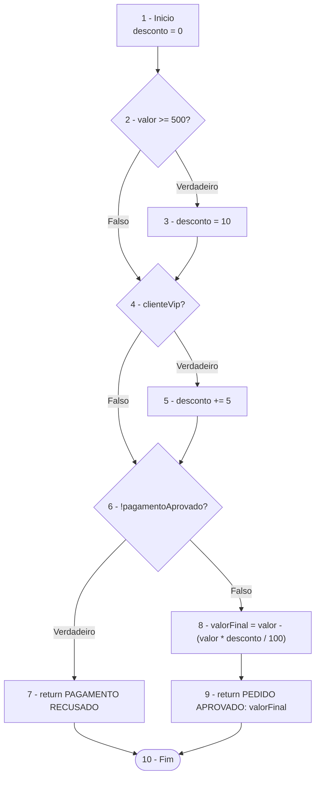

Caminhos independentes:

P1: 1 -> 2(F) -> 4(F) -> 6(F) -> 8 -> 9 -> 10
Entrada: valor = 100, clienteVip = false, pagamentoAprovado = true
Resultado: PEDIDO APROVADO: 100.0

P2: 1 -> 2(V) -> 3 -> 4(F) -> 6(F) -> 8 -> 9 -> 10
Entrada: valor = 500, clienteVip = false, pagamentoAprovado = true
Resultado: PEDIDO APROVADO: 450.0

P3: 1 -> 2(F) -> 4(V) -> 5 -> 6(F) -> 8 -> 9 -> 10
Entrada: valor = 100, clienteVip = true, pagamentoAprovado = true
Resultado: PEDIDO APROVADO: 95.0

P4: 1 -> 2(F) -> 4(F) -> 6(V) -> 7 -> 10
Entrada: valor = 100, clienteVip = false, pagamentoAprovado = false
Resultado: PAGAMENTO RECUSADO

