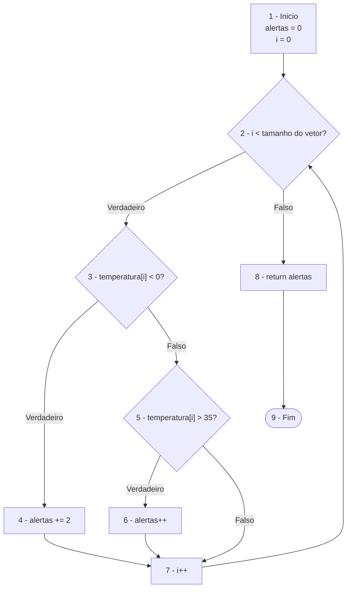

Caminhos independentes:

P1: 1 -> 2(F) -> 8 -> 9
Entrada: temperaturas = {}
Resultado: 0

P2: 1 -> 2(V) -> 3(V) -> 4 -> 7 -> 2(F) -> 8 -> 9
Entrada: temperaturas = {-5}
Resultado: 2

P3: 1 -> 2(V) -> 3(F) -> 5(V) -> 6 -> 7 -> 2(F) -> 8 -> 9
Entrada: temperaturas = {40}
Resultado: 1

P4: 1 -> 2(V) -> 3(F) -> 5(F) -> 7 -> 2(F) -> 8 -> 9
Entrada: temperaturas = {20}
Resultado: 0

