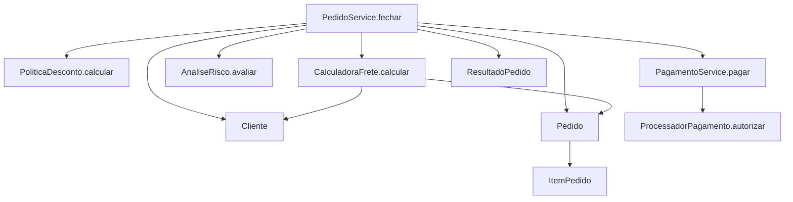
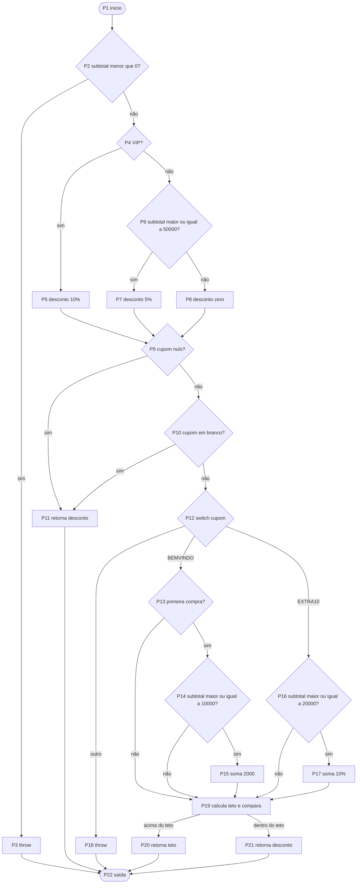
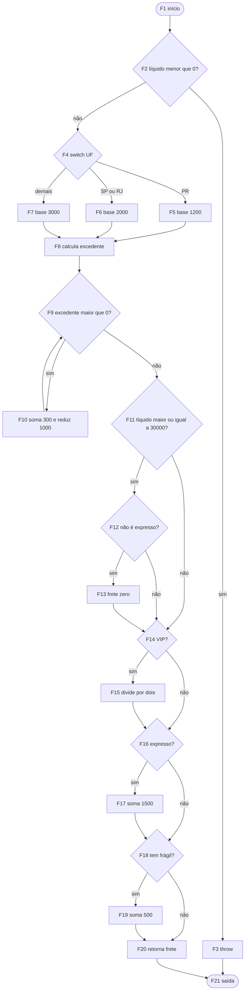
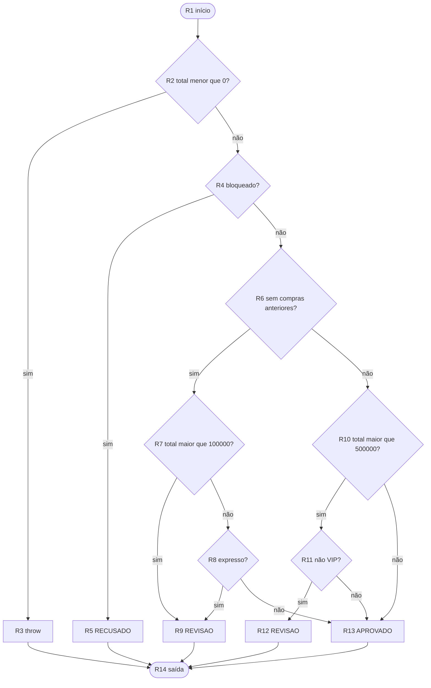
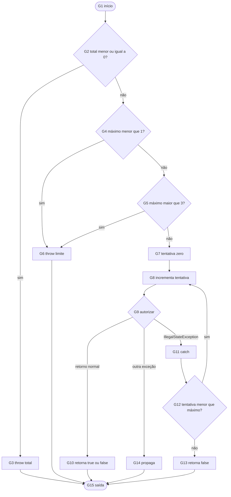
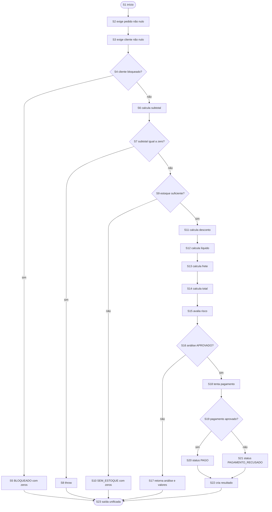

# Relatório do grupo

Integrantes:

- Breno Bertaglia Nosima — 24113673-2
- Felipe Galeti Gôngora — 24036480-2
- Henrique Kendi Ikeda — 24039456-2

## 1. Estratégia usada

Primeiro executamos o teste de exemplo e observamos o relatório do JaCoCo. Depois criamos testes unitários para cada classe e, por último, testes de colaboração para `PedidoService`. Os resultados esperados foram calculados manualmente a partir das regras do enunciado. Não usamos a implementação para calcular o valor esperado e não usamos Mockito; o processador de pagamento foi substituído por lambdas com listas ou contadores.

Nos CFGs, cada condição atômica de um curto-circuito (`&&` ou `||`) foi considerada um nó de decisão separado. Um `switch` foi representado por um nó com várias saídas e contribui com `número de saídas - 1` para a complexidade. Todos os retornos e `throw` explícitos foram ligados a uma saída unificada. No pagamento, a chamada ao processador foi modelada com três resultados: retorno normal, `IllegalStateException` capturada e outra exceção propagada. Exceções implícitas que apenas atravessam `PedidoService` aparecem como saída excepcional, mas não entram na contagem de arestas, da mesma forma que o JaCoCo não as considera branches.

## 2. Relacionamento e grafo de chamadas



`PedidoService` coordena o fechamento. `Pedido` calcula subtotal, peso, fragilidade e estoque usando os itens. Se o fluxo continuar, o serviço chama desconto, frete, risco e, somente quando aprovado, pagamento.

## 3. Grafos de fluxo de controle

### 3.1 `PoliticaDesconto.calcular`



### 3.2 `CalculadoraFrete.calcular`



### 3.3 `AnaliseRisco.avaliar`



### 3.4 `PagamentoService.pagar`



### 3.5 `PedidoService.fechar`



Chamadas que lançam exceções não tratadas, como cupom desconhecido ou falha definitiva do processador, interrompem `fechar` e chegam à saída excepcional. Elas foram testadas, mesmo não aparecendo como branches do JaCoCo.

## 4. Complexidade de McCabe

| Método | Nós | Arestas | V(G) | Caminhos independentes | Restrições de viabilidade |
| --- | ---: | ---: | ---: | --- | --- |
| `PoliticaDesconto.calcular` | 22 | 32 | 12 | 12 | Desconto acima do teto exige uma combinação, por exemplo VIP novo com `BEMVINDO` e subtotal de 10000. |
| `CalculadoraFrete.calcular` | 21 | 29 | 10 | 10 | A base gratuita só ocorre com líquido >= 30000 e entrega normal; expresso impede esse caminho. |
| `AnaliseRisco.avaliar` | 14 | 20 | 8 | 8 | Cliente bloqueado encerra a análise antes das regras de histórico, valor e expresso. |
| `PagamentoService.pagar` | 15 | 20 | 7 | 7 | Só `IllegalStateException` chega ao laço; retorno `false` e outras exceções encerram na primeira chamada. |
| `PedidoService.fechar` | 23 | 27 | 6 | 6 | `RECUSADO` de risco é inviável pelo serviço, pois bloqueado retorna `BLOQUEADO` antes. Totais negativos também são inviáveis com entradas válidas. |

Em todos os casos foi aplicada a fórmula `V(G) = E - N + 2`. Por exemplo, no frete: `29 - 21 + 2 = 10`.

## 5. Base de caminhos independentes e dados

### Desconto — 12 caminhos

1. Subtotal negativo: `-1`, gera exceção.
2. VIP e cupom nulo: subtotal 10000, desconto 1000.
3. Comum no limite de R$ 500,00 e cupom vazio: desconto 2500.
4. Comum abaixo do limite e cupom em branco: desconto zero.
5. Novo com `BEMVINDO` elegível: subtotal 10000, desconto 2000.
6. Cliente antigo com `BEMVINDO`: sem adicional.
7. Novo abaixo de R$ 100,00 com `BEMVINDO`: sem adicional.
8. `EXTRA10` abaixo de R$ 200,00: sem adicional.
9. `EXTRA10` no limite: desconto 2000.
10. VIP com `EXTRA10`: soma os dois percentuais.
11. Cupom desconhecido: gera exceção.
12. VIP novo, subtotal 10000 e `BEMVINDO`: cálculo bruto 3000, limitado a 2000.

### Frete — 10 caminhos

1. Líquido negativo: exceção.
2. PR, até 2 kg, normal, comum e sem frágil: 1200.
3. SP/RJ: 2000.
4. Outra UF: 3000.
5. Peso de 2001 g: uma iteração e mais 300.
6. Peso de 3001 g: duas iterações e mais 600.
7. Líquido 30000, normal: frete básico e peso zerados.
8. Líquido 30000, expresso: não recebe gratuidade e soma 1500.
9. VIP: divide a base antes dos adicionais.
10. Expresso e frágil: soma 1500 e 500; dois itens frágeis continuam somando 500 uma vez.

### Risco — 8 caminhos

1. Total negativo: exceção.
2. Bloqueado: `RECUSADO`.
3. Novo, total 100000, normal: `APROVADO`.
4. Novo, total 100001: `REVISAO`.
5. Novo e expresso: `REVISAO` mesmo com total baixo.
6. Antigo comum, total 500000: `APROVADO`.
7. Antigo comum, total 500001: `REVISAO`.
8. Antigo VIP, total 500001: `APROVADO`.

### Pagamento — 7 caminhos

1. Total zero ou negativo: exceção.
2. Limite menor que 1: exceção.
3. Limite maior que 3: exceção.
4. Processador aprova na primeira chamada.
5. Processador recusa na primeira chamada, sem repetição.
6. Primeira chamada indisponível e segunda aprova.
7. Todas as tentativas indisponíveis; outra exceção também foi testada como caminho excepcional adicional.

### Fechamento — 6 caminhos

1. Cliente bloqueado: `BLOQUEADO`, valores zero e nenhuma cobrança.
2. Subtotal zero: exceção e nenhuma cobrança.
3. Estoque insuficiente: `SEM_ESTOQUE`, valores zero e nenhuma cobrança.
4. Risco não aprovado: `REVISAO` com valores calculados e nenhuma cobrança.
5. Risco aprovado e pagamento aprovado: `PAGO`.
6. Risco aprovado e pagamento recusado: `PAGAMENTO_RECUSADO`; também testamos esgotamento das três tentativas.

## 6. Matriz de testes

| ID / método JUnit | Unidade | Entrada e estado do stub | Resultado esperado | Caminho ou aresta | Critério atendido |
| --- | --- | --- | --- | --- | --- |
| C1 `deveCriarClienteComHistoricoValido` | Cliente | VIP, desbloqueado, histórico zero | Objeto criado | construtor válido | linha/método |
| C2 `naoDeveAceitarHistoricoNegativo` | Cliente | histórico -1 | exceção | validação verdadeira | branch/exceção |
| I1 `deveCalcularTotalEInformarDisponibilidade` | ItemPedido | quantidade 2 e estoque suficiente/insuficiente | total 2500; true/false | auxiliares | método/branch |
| I2 `naoDeveAceitarSkuNuloOuEmBranco` | ItemPedido | `null` e espaços | exceção | curto-circuito `||` | branch/exceção |
| I3 `naoDeveAceitarPrecoInvalido` | ItemPedido | -1, 0 e 1000001 | exceção | limites do preço | branch/limite |
| I4 `naoDeveAceitarQuantidadeInvalida` | ItemPedido | -1 e 101 | exceção | limites da quantidade | branch/limite |
| I5 `naoDeveAceitarEstoqueNegativo` | ItemPedido | estoque -1 | exceção | estoque inválido | branch/exceção |
| I6 `naoDeveAceitarPesoInvalido` | ItemPedido | -1, 0 e 100001 | exceção | limites do peso | branch/limite |
| I7 `deveAceitarValoresNosLimites` | ItemPedido | mínimos e máximos válidos | não lança | lados válidos | branch/limite |
| P1 `deveCopiarListaECalcularSubtotalEPeso` | Pedido | item ativo e inativo; lista original alterada | subtotal 2000, peso 600 e cópia preservada | `for`/`continue` | método/laço |
| P2 `deveEncontrarItemFragilAtivoDepoisDeItensNaoFrageis` | Pedido | inativo frágil, ativo normal, ativo frágil | true no último item | curto-circuito e retorno | branch/laço |
| P3 `deveAvaliarEstoqueDeTodasAsLinhas` | Pedido | falta no início/no fim e estoque suficiente | false/false/true | `for` e `break` | branch/laço |
| P4 `deveAceitarListaVaziaEUfDesconhecidaBemFormada` | Pedido | lista vazia e UF XX | valores zero e estoque true | zero iterações | laço/limite |
| P5/P6 validações de lista e UF | Pedido | nulo, 101 itens, item nulo, UF inválida | exceções | construtor | branch/exceção |
| D1 `deveAplicarDescontoBasicoConformeOTipoDoCliente` | Desconto | VIP, comum no limite, comum abaixo | 10%, 5% e zero | P4/P6/P9/P10 | branch/limite |
| D2 `deveAplicarBemVindoSomenteParaPrimeiraCompraElegivel` | Desconto | novo elegível, abaixo do limite, cliente antigo | 2000, zero, zero | P12-P15 | curto-circuito/limite |
| D3 `deveAplicarExtra10SomenteAPartirDoLimite` | Desconto | 19999 e 20000 | zero e 2000 | P16/P17 | branch/limite |
| D4 `deveLimitarDescontoAVintePorCento` | Desconto | VIP novo + BEMVINDO | 2000 | P19-P20 | teto/branch |
| D5 `deveTruncarPercentuaisEmCentavos` | Desconto | subtotal 20009 | 2000 | divisão inteira | truncamento |
| D6 `deveRejeitarSubtotalNegativoECupomDesconhecido` | Desconto | -1 e cupom inválido | exceção | P2/P18 | exceção |
| F1 `deveUsarTarifaDaUf` | Frete | PR, SP, RJ e SC | 1200, 2000, 2000, 3000 | F4-F7 | switch/default |
| F2 `deveCobrarCadaQuiloExcedenteOuFracao` | Frete | 2000, 2001, 3000 e 3001 g | 0, 1, 1 e 2 adicionais | F9-F10 | while/limites |
| F3 `deveDarFreteGratisEmEntregaNormalAPartirDeTrezentosReais` | Frete | 29999, 30000 normal e 30000 expresso | pago, grátis, pago + expresso | F11-F13 | curto-circuito/limite |
| F4 `deveAplicarVipAntesDosAdicionais` | Frete | VIP, SP, expresso e frágil | 3000 | F14-F19 | combinação independente |
| F5/F6 testes de fragilidade e adicionais | Frete | dois frágeis; expresso frágil | adicional único e adicionais mantidos | F16-F19 | branch/combinação |
| F7 `naoDeveAceitarValorLiquidoNegativo` | Frete | líquido -1 | exceção | F2-F3 | exceção |
| R1 `deveRecusarClienteBloqueado` | Risco | bloqueado | RECUSADO | R4-R5 | retorno antecipado |
| R2 `deveRevisarClienteNovoPorValorOuEntregaExpressa` | Risco | 100000, 100001 e expresso | aprovado/revisão/revisão | R6-R9 | `||`/limites |
| R3 `deveRevisarClienteAntigoComumSomenteAcimaDeCincoMil` | Risco | 500000, 500001 e VIP | aprovado/revisão/aprovado | R10-R13 | `&&`/limites |
| R4 `naoDeveAceitarTotalNegativo` | Risco | -1 | exceção | R2-R3 | exceção |
| G1 `deveAprovarNaPrimeiraTentativaEEnviarOValorCorreto` | Pagamento | stub true e lista | true e uma chamada de 12345 | G9-G10 | argumento/efeito |
| G2 `devePararImediatamenteQuandoPagamentoForRecusado` | Pagamento | stub false | false e uma chamada | retorno imediato | efeito |
| G3 `deveTentarNovamenteAposIndisponibilidade` | Pagamento | exceção, depois true | true e duas chamadas | catch/laço | exceção/iteração |
| G4 `deveEsgotarOLimiteDeTentativas` | Pagamento | sempre indisponível | false e três chamadas | G11-G13 | do/while |
| G5 `devePropagarExcecaoQueNaoRepresentaIndisponibilidade` | Pagamento | outra exceção | exceção propagada | G9-G14 | exceção não branch |
| G6/G7 validações e limites | Pagamento | nulos, totais e limites inválidos/válidos | exceção ou true | G2-G7 | branches/limites |
| S1 `deveFecharPedidoDeClienteComumComFreteDoParanaEPagamentoAprovado` | PedidoService | stub true | PAGO, total 11200, uma cobrança | fluxo completo | colaboração |
| S2 `deveRetornarBloqueadoAntesDeAvaliarItensECupom` | PedidoService | lista vazia, cupom inválido, stub contador | BLOQUEADO e zero chamadas | S4-S5 | ordem/retorno |
| S3 `deveRejeitarPedidoSemItensAtivosSemCobrar` | PedidoService | linha inativa | exceção e zero chamadas | S7-S8 | ordem/exceção |
| S4 `deveRetornarSemEstoqueAntesDeValidarCupom` | PedidoService | sem estoque e cupom inválido | SEM_ESTOQUE e zero chamadas | S9-S10 | ordem/retorno |
| S5 `devePropagarCupomInvalidoSemCobrar` | PedidoService | estoque válido e cupom inválido | exceção e zero chamadas | saída excepcional | exceção |
| S6 `deveEnviarPedidoExpressoDeClienteNovoParaRevisaoSemCobrar` | PedidoService | novo e expresso | REVISAO, total 12700, zero chamadas | S16-S17 | colaboração |
| S7 `deveEnviarPedidoDeAltoValorParaRevisaoSemCobrar` | PedidoService | antigo comum, total alto | REVISAO, total 950000 | outro caminho de risco | colaboração |
| S8 `deveRetornarPagamentoRecusadoSemRepetirRecusaDefinitiva` | PedidoService | stub false | PAGAMENTO_RECUSADO, uma chamada | S18-S21 | colaboração/efeito |
| S9 `deveRetornarPagamentoRecusadoAposTresIndisponibilidades` | PedidoService | stub sempre indisponível | PAGAMENTO_RECUSADO, três chamadas | pagamento com laço | colaboração/efeito |
| S10 `deveValidarProcessadorPedidoEClienteObrigatorios` | PedidoService | referências nulas | `NullPointerException` | validação inicial | exceção |

## 7. Evolução da cobertura

| Etapa | Testes executados | Linhas | Branches | Métodos | Classes | Lacunas e justificativas |
| --- | ---: | ---: | ---: | ---: | ---: | --- |
| Teste fornecido | 1 | 80,56% (87/108) | 43,10% (50/116) | 95,24% (20/21) | 100% (9/9) | Muitas classes eram chamadas, mas quase todas as alternativas estavam descobertas. |
| Testes unitários | 44 | 78,70% (85/108) | 91,38% (106/116) | 80,95% (17/21) | 77,78% (7/9) | As unidades ficaram cobertas; `PedidoService` e `ResultadoPedido` não foram executados nessa etapa isolada. |
| Suíte completa | 54 | 100% (108/108) | 100% (116/116) | 100% (21/21) | 100% (9/9) | Nenhuma linha ou branch alcançável ficou descoberta. |

O número de métodos alto no teste inicial ocorre porque records geram acessores e outros métodos que o JaCoCo também contabiliza. Por isso cobertura de método ou classe, sozinha, não prova que as regras foram bem testadas.

## 8. Análise crítica

### Ramos não são todos os caminhos

Mesmo cobrindo os dois resultados de cada `if` do frete, ainda poderiam faltar combinações. Por exemplo, testes separados poderiam cobrir VIP, expresso e frágil, sem nunca testar os três juntos. Isso deixaria sem verificação a ordem da regra: primeiro a base é dividida para VIP e só depois são somados R$ 15,00 e R$ 5,00. O teste `deveAplicarVipAntesDosAdicionais` cobre essa combinação.

Os laços também criam mais caminhos do que o contador de branches mostra. No peso, o JaCoCo precisa apenas ver a condição do `while` verdadeira e falsa para cobrir os ramos. Mesmo assim testamos zero, uma e duas iterações, incluindo quilograma exato e fração. No pedido testamos lista vazia, uma e várias linhas, item inativo e falta de estoque no início e no fim.

### Curto-circuito

Em `cupom == null || cupom.isBlank()`, `isBlank()` não é executado quando o cupom é nulo. Foram usados casos nulo, vazio e com espaços. Em `total > 100000 || expresso`, `expresso` não é consultado quando o valor já é alto; por isso também usamos valor baixo com entrega expressa. Em `total > 500000 && !vip`, o segundo operando não é avaliado quando o total não ultrapassa o limite; usamos total no limite, acima com cliente comum e acima com VIP.

### Caminhos inviáveis no serviço

`AnaliseRisco` consegue retornar `RECUSADO` para cliente bloqueado em um teste unitário. Esse resultado é inviável por `PedidoService.fechar`, pois o serviço retorna `BLOQUEADO` antes de chamar a análise. Da mesma forma, `CalculadoraFrete` aceita uma chamada isolada com líquido negativo para validar sua exceção, mas o serviço não produz líquido negativo porque o desconto é limitado a 20% do subtotal. `PagamentoService` também possui validações de total não positivo e limite fora de 1 a 3 que não são alcançáveis pelo serviço, que sempre usa três tentativas e só paga pedidos ativos com total positivo.

### Exceções não contadas como branch

O `catch (IllegalStateException)` em `PagamentoService` não aparece como branch do JaCoCo. Mesmo assim foram testadas uma indisponibilidade seguida de sucesso e três indisponibilidades até esgotar o limite. Também usamos uma `IllegalArgumentException` lançada pelo stub e confirmamos que ela é propagada. Assim, 100% de branches não foi usado como justificativa para ignorar tratamento de exceções.

### Alteração proposital

Mudamos temporariamente a tarifa do PR em `CalculadoraFrete` de `1_200` para `1_201` centavos. Ao executar `CalculadoraFreteTest`, 5 dos 7 testes falharam. O teste mais direto foi `deveUsarTarifaDaUf`, que esperava 1200 e recebeu 1201. Também falharam testes de peso, gratuidade/expresso, fragilidade e adicionais. Depois da confirmação, a tarifa foi restaurada para `1_200` e a suíte completa voltou a passar.

## 9. Resultado final

Comando utilizado:

```sh
mvn clean test
```

Resultado final: **54 testes executados, 0 falhas, 0 erros e 0 ignorados**. O relatório HTML está em `target/site/jacoco/index.html`, e os relatórios XML e CSV estão na mesma pasta.
